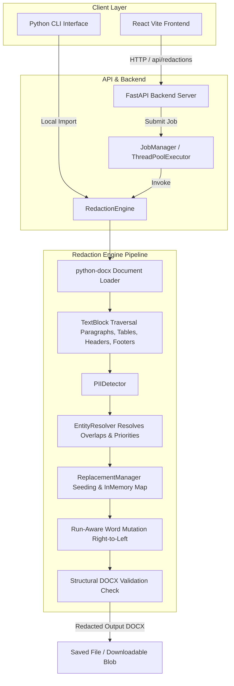

# PII Redaction Tool

A hybrid, deterministic, and locally executable PII (Personally Identifiable Information) detection and redaction system designed specifically for structured Microsoft Word (`.docx`) documents. The tool is engineered to identify sensitive user and entity information in corporate documents—such as the Red Herring Prospectus (RHP)—and replace them with realistic, synthetically generated equivalents while preserving the document's original formatting, structure, headers, footers, tables, and styles.

This project was built as part of the Scaler AI Labs environment data internship assignment. It is designed to work completely locally without transmitting any document content to external Large Language Models (LLMs) or third-party AI APIs.

---

## What It Does

The PII Redaction Tool accepts an input Word document (`.docx`), scans all text content (including paragraphs, tables, nested tables, headers, and footers), detects target PII categories, generates deterministic synthetic replacements, and writes out a new, fully redacted, and structurally validated Word document. 

Key objectives achieved:
1. **Local Privacy**: 100% offline detection and replacement using Python, spaCy, and regex. No cloud API or external LLM dependencies.
2. **Preservation of Document Styles**: Mutates the document at the individual Word Run XML level to avoid destroying paragraph styles, fonts, bold/italic markup, tables, or alignment.
3. **Structured Replacement Consistency**: If a specific company, email, or person appears multiple times throughout a document, the system ensures they are consistently mapped to the same synthetic replacement during a run.
4. **Candidate-Level Accuracy**: Evaluates false negatives and false positives on a candidate-level basis, achieving **90.7% candidate-level accuracy** on a manually annotated real-RHP evaluation sample.

---

## Supported PII Types

The tool supports all nine required PII categories:

| PII Type | Classification Class | Detection Strategy | Synthetic Replacement Form |
| :--- | :--- | :--- | :--- |
| **Person** | `PERSON` | spaCy NER (`en_core_web_sm`) + Role-Context Enhancements + Case-Filter Heuristics | Realistic, gender-neutral Indian names (`Faker` with `en_IN` locale) |
| **Email** | `EMAIL` | Regex-based identifier with boundaries and subdomain validation | Non-resolvable synthetic email address utilizing `@example.com` |
| **Phone** | `PHONE` | Regex pattern matching Indian/International formats + Contextual Verification | Deterministic synthetic numbers preserving original separators and country codes |
| **Company** | `COMPANY` | Regex legal-suffix heuristics (e.g. Ltd, Pvt Ltd, LLP) + filtered spaCy ORG NER | Realistic business names preserving legal suffix formatting |
| **Address** | `ADDRESS` | Multi-token Indian street/building address patterns + contextual keyword markers | Indian-style street, building, city, and state mapping; multiline matching |
| **SSN** | `SSN` | US Social Security Number pattern matching + Valid range verification | Non-issued synthetic SSN placeholder (e.g., `000-00-XXXX` or formatting-matched) |
| **Credit Card**| `CREDIT_CARD` | 13-19 digit sequence extraction + Luhn Algorithm validation | Test-safe dummy credit card numbers passing Luhn validation |
| **Date of Birth**| `DOB` | Date pattern matching + Strict birth-context keyword verification (e.g. "Born on", "DOB:") | Plausible adult date of birth preserving the original date format style |
| **IP Address** | `IP_ADDRESS` | IPv4 regex extraction + Python `ipaddress` validation | Reserved test/documentation IPv4 address ranges (RFC 5737: `192.0.2.0/24`, etc.) |

---

## Key Features

- **Double-Pass Pipeline**: Combines deterministic regular expressions (with strict range/Luhn validators) and semantic natural language processing (spaCy NER).
- **Run-Aware Document Mutation**: Parses entity spans across split text runs inside Word paragraphs and resolves changes right-to-left to prevent offset drift.
- **Deterministic Seeding**: Supports an optional `--seed` parameter (default: `42`) to produce identical synthetic replacements across multiple CLI or API runs.
- **FastAPI Async Jobs Backend**: Provides an asynchronous job management API featuring isolated directory queues, concurrency controls, and safety checks for large documents.
- **React Upload Dashboard**: A responsive, modern React UI featuring drag-and-drop file upload, real-time polling, and breakdown summaries of redacted PII categories.
- **Automated Validation**: Re-opens and parses generated output files programmatically using `python-docx` to verify structural schema integrity (matching table counts, header sections, and embedded media assets).

---

## Architecture

The CLI tool and the FastAPI Web API share the exact same `RedactionEngine` and detection/replacement pipeline, ensuring identical behavior across interfaces.



---

## Detection Approach

The core detection engine ([PIIDetector](file:///e:/scaler-pii-redaction-tool/backend/app/detectors/unified.py)) uses a hybrid modular approach:

1. **StructuredPIIDetector**: Uses regular expressions and validation rules for high-precision structured tokens:
   - **Email**: Matches alphanumeric patterns with `@` domains, validating against punctuation boundaries and subdomains.
   - **Phone**: Detects Indian landline and mobile patterns. Rejects simple long numbers unless accompanied by context words (`Tel`, `Phone`, `Mobile`).
   - **SSN**: Validates against US SSN syntax and filters out numbers in invalid ranges (e.g. starts with `000` or `666`).
   - **Credit Card**: Extracts sequences of 13 to 19 digits and validates them with the Luhn algorithm.
   - **DOB**: Identifies date patterns (ISO, DD/MM/YYYY, Month DD, YYYY) but redacts them **only** if they occur directly next to birth-related keywords. Ordinary financial dates are ignored.
   - **IP Address**: Extracts IPv4 addresses and validates them using Python's native `ipaddress` module to exclude out-of-range values.

2. **SemanticPIIDetector**: Uses spaCy's natural language processing model `en_core_web_sm` and rule-based post-processing heuristics:
   - **Person**: Scans for spaCy `PERSON` tags, enhanced by context keywords (e.g. `Promoter`, `Director`, `Company Secretary`). Filters out common capitalized headings and regulatory names.
   - **Company**: Matches business entities by tracking legal suffixes (`Limited`, `LLP`, `Pvt Ltd`) and combining them with filtered spaCy `ORG` entities.
   - **Address**: Scans for multi-token structural keywords (e.g. `Plot`, `Building`, `Marg`, `Taluka`, `PIN`, `District`, `Floor`) to extract full address blocks. stand-alone city/state terms are preserved.

3. **EntityResolver**: Resolves overlapping entities and boundary mismatches. Because structured regular expressions have higher precision, the resolver applies a strict priority system:
   `EMAIL` > `SSN` > `CREDIT_CARD` > `IP_ADDRESS` > `PHONE` > `DOB` > `ADDRESS` > `COMPANY` > `PERSON`
   
   If a `COMPANY` span overlaps with a `PERSON` span, the overlapping span is resolved, favoring structured identifiers first, and larger semantic spans second.

---

## False-Positive Controls

Corporate documents contain financial tables, references to laws, and numeric values that resemble PII. To maintain high precision, the system implements filters for common hard negatives:
- **Corporate Identifiers**: Explicitly ignores Corporate Identity Numbers (CIN), Director Identification Numbers (DIN), and SEBI registration IDs.
- **Financial values**: Number sequences denoting currency values, share counts, and percentages are protected and never classified as telephone or credit card numbers.
- **Ordinary Dates**: Incorporation dates, filing dates, and agreement dates are protected and never classified as Dates of Birth (`DOB`).
- **Generic Headings**: Common prospectus labels like "Board of Directors", "Audit Committee", or "Government of India" are protected from semantic company/person classification.

---

## Synthetic Replacement Strategy

Redacted PII is replaced with fake, synthetic equivalents managed by the [ReplacementManager](file:///e:/scaler-pii-redaction-tool/backend/app/replacement/generator.py):
- **Consistent Mapping**: A dictionary maps `(normalized_original_text, pii_type)` to its synthetic replacement. This mapping is job-local and stored in memory. Every repeating occurrence of a company or name receives the exact same replacement.
- **Safety**: Synthetic emails use `example.com` to prevent generating deliverable domains. IP addresses use RFC 5737 documentation ranges. Phone numbers use deterministic, inactive configurations.
- **Privacy**: Mappings are kept in memory and destroyed at the end of the processing job. Mappings are never written to logs or sent to the client.

---

## DOCX Preservation

Standard redaction libraries often clear paragraph text, destroying fonts, colors, sizes, and styling. The tool employs a **Run-Aware Document Mutation** strategy:
1. **Logical Text Extraction**: The document is traversed recursively. For every paragraph or table cell, a logical text string is reconstructed by concatenating the individual XML text runs (`paragraph.runs`).
2. **Offset Mapping**: Detection operates on this unified logical string. Spans `[start, end)` are mapped back to the contributing runs.
3. **Right-to-Left Replacement**: Replacements are applied from right-to-left. This prevents character insertion in preceding spans from corrupting the index offsets of subsequent spans.
4. **Style Inheritance**: The synthetic replacement is written directly into the first run affected by the span. Intermediate runs containing the rest of the PII are cleared of text (but kept in place to preserve formatting), and the suffix remains intact in the trailing runs. The replacement inherits the text formatting (bold, italic, font size) of the initial run.

### Traversal and Structural Validation
The traversal engine recursively scans:
- Normal body paragraphs.
- Tables, cells, and nested tables.
- Headers and footers (tracking unique headers by XML part to avoid double-redaction).

After writing the redacted document, a structural validation pass re-opens the file to confirm that structural parameters remain unchanged.

---

## Project Structure

A clean, modular layout separates detection, mutation, api, and evaluation components:

```text
scaler-pii-redaction-tool/
├── README.md                      # Project documentation (this file)
├── .gitignore                     # Git ignore rules (ignores reference documents and private data)
├── AGENTS.md                      # Workspace instructions and guidelines
├── backend/                       # Python FastAPI Backend & CLI
│   ├── app/
│   │   ├── api/                   # API routes and JSON schema definitions
│   │   ├── core/                  # Configuration settings (config.py)
│   │   ├── detectors/             # Structured, semantic, and resolver code
│   │   ├── document/              # DOCX traversal, mutation, and validation
│   │   ├── jobs/                  # In-memory async job queue & file sanitization
│   │   ├── models/                # PII types and result models
│   │   ├── redaction/             # Core RedactionEngine coordinator
│   │   ├── replacement/           # Synthetic Faker generator mapping
│   │   ├── main.py                # FastAPI app initialization
│   │   └── __main__.py            # CLI entrypoint
│   ├── tests/                     # Unit and integration pytest suites
│   ├── requirements.txt           # Production dependencies (including spaCy model wheel)
│   └── pytest.ini                 # Pytest configuration settings
├── frontend/                      # React / Vite / Plain CSS Frontend
│   ├── src/
│   │   ├── components/            # UI components (Upload, Status details)
│   │   ├── services/              # API Client service wrapper
│   │   ├── App.jsx                # Main interface coordinator
│   │   └── index.css              # Styling rules
│   ├── package.json               # Frontend dependencies & npm script configurations
│   └── vite.config.js             # Vite development server configuration
├── evaluation/                    # Benchmarking & Ground-Truth Scoring
│   ├── evaluate.py                # Main benchmark script
│   ├── metrics.json               # Frozen Phase 12 results (Source of Truth)
│   ├── methodology.md             # Benchmark methodology description
│   ├── synthetic_cases.jsonl      # Public capability verification dataset
│   ├── private_ground_truth.jsonl # (Git-ignored) Real ground-truth annotations
│   └── private_eval_errors.jsonl  # (Git-ignored) Annotation error details
└── output/                        # (Git-ignored) Saved redacted DOCX outputs
```

---

## Setup & Installation

### Prerequisites
- Python 3.11
- Node.js (v18+) and npm

### 1. Backend Setup
Clone the repository and install dependencies in a virtual environment:

```bash
cd backend
python -m venv .venv
# On Windows (PowerShell):
.venv\Scripts\Activate.ps1
# On Linux/macOS:
source .venv/bin/activate

pip install -r requirements.txt
```

*Note: The `requirements.txt` file is pre-configured to automatically install the `en_core_web_sm` spaCy model from Explosion's releases. No separate spaCy download command is required.*

### 2. Frontend Setup
Open a separate terminal window and install the React packages:

```bash
cd frontend
npm install
```

---

## CLI Usage

The command-line interface accepts any Word document and processes it locally. Run the CLI tool from the `backend/` directory:

```bash
python -m app --input "../input.docx" --output "../output/redacted.docx" --seed 42
```

### Options
- `--input`: Path to the input `.docx` file (Required)
- `--output`: Path to save the redacted `.docx` output file (Required)
- `--seed`: Integer seed for deterministic synthetic replacements (Default: `42`)

---

## Web Application

The web interface provides an interactive, drag-and-drop dashboard to upload and process files.

### Start the Servers

1. **Start the FastAPI backend** (from the `backend/` directory):
   ```bash
   uvicorn app.main:app --reload
   ```
   The backend server will run at `http://localhost:8000`.

2. **Start the React dev server** (from the `frontend/` directory):
   ```bash
   npm run dev
   ```
   The application dashboard will open in your browser at `http://localhost:5173`.

### Upload Workflow
1. Drag and drop any `.docx` file or select a file to upload.
2. The client performs initial checks (validates file size limits and `.docx` extension).
3. Upon upload, a background job is queued. The UI polls the backend every 2 seconds.
4. Once completed, the dashboard displays:
   - Redaction processing time.
   - Aggregate count of redacted items.
   - Breakdown of redactions across the nine PII categories.
5. Click **Download Redacted Document** to download the validated output file.
6. The job's temporary directory is deleted from the backend server when you click **Reset** or when the job TTL expires.

---

## API Documentation

FastAPI exposes the following endpoints (prefixed with `/api`):

| Method | Endpoint | Description |
| :--- | :--- | :--- |
| `GET` | `/api/health` | Health check endpoint returning API service status. |
| `POST` | `/api/redactions` | Uploads a `.docx` file and creates an asynchronous redaction job. |
| `GET` | `/api/redactions/{job_id}` | Retrieves the current state, runtime, and redaction counts of a job. |
| `GET` | `/api/redactions/{job_id}/download` | Downloads the redacted `.docx` output file (only when status is `COMPLETED`). |
| `DELETE`| `/api/redactions/{job_id}` | Deletes job metadata and deletes its temporary directory from storage. |

### Job Lifecycle
A job goes through the following states:
`QUEUED` → `PROCESSING` → `COMPLETED` (or `FAILED` if validation or processing fails).

---

## Evaluation Metrics

The system's performance was evaluated using two separate benchmarks: a manually annotated real-RHP prospectus sample and a synthetic validation dataset.

### 1. Real Prospectus Evaluation (RHP)
Metrics are based on a manually annotated sample of **150 TextBlocks** (68 body paragraphs and 82 table cells, sampling seed `42`), containing **91 positive PII entities** and **156 hard-negative candidate blocks**:

- **Candidate-Level Accuracy**: **90.7%**
- **Micro-averaged Precision**: **79.4%**
- **Micro-averaged Recall**: **84.6%**
- **Micro-averaged F1 Score**: **81.9%**

*Note: Candidate-Level Accuracy measures correctness over positive PII entities plus explicitly defined hard negatives (e.g. corporate DINs, financial figures). Token-level accuracy is avoided because the vast amount of non-PII text in the prospectus would artificially inflate the accuracy score close to 100%.*

#### Per-Category Performance Table (Real RHP)
| PII Type | Gold | Predicted | True Positive (TP) | False Positive (FP) | False Negative (FN) | Precision | Recall | F1 Score |
| :--- | :---: | :---: | :---: | :---: | :---: | :---: | :---: | :---: |
| **PERSON** | 32 | 34 | 27 | 7 | 5 | 0.794 | 0.844 | 0.818 |
| **EMAIL** | 16 | 16 | 16 | 0 | 0 | 1.000 | 1.000 | 1.000 |
| **PHONE** | 9 | 9 | 7 | 2 | 2 | 0.778 | 0.778 | 0.778 |
| **COMPANY** | 31 | 30 | 26 | 4 | 5 | 0.867 | 0.839 | 0.852 |
| **ADDRESS** | 3 | 8 | 1 | 7 | 2 | 0.125 | 0.333 | 0.182 |
| **SSN** | 0 | 0 | 0 | 0 | 0 | N/A | N/A | N/A |
| **CREDIT_CARD**| 0 | 0 | 0 | 0 | 0 | N/A | N/A | N/A |
| **DOB** | 0 | 0 | 0 | 0 | 0 | N/A | N/A | N/A |
| **IP_ADDRESS** | 0 | 0 | 0 | 0 | 0 | N/A | N/A | N/A |

### 2. Synthetic Capability Evaluation (Not Real RHP)
To verify detectors for categories that do not occur naturally in the RHP (such as SSNs, credit cards, and IP addresses), a synthetic benchmark containing **20 cases** and **56 positive instances** was executed:

- **Synthetic Candidate-Level Accuracy**: **91.3%**
- **Synthetic Micro Precision**: **96.2%**
- **Synthetic Micro Recall**: **91.1%**
- **Synthetic Micro F1**: **93.6%**

See [EVALUATION_REPORT.md](file:///e:/scaler-pii-redaction-tool/evaluation/EVALUATION_REPORT.md) and [metrics.json](file:///e:/scaler-pii-redaction-tool/evaluation/metrics.json) for details and per-type tables.

---

## Tests

The project has automated unit and integration tests covering the detectors, resolvers, mutation engine, and API endpoints.

To run the test suites:

### Backend Tests
Execute pytest in the `backend/` directory:
```bash
cd backend
python -m pytest
```
*Expected output: 162 passing tests.*

### Frontend Tests
Execute vitest in the `frontend/` directory:
```bash
cd frontend
npm run test
```
*Expected output: 14 passing tests (2 test files).*

---

## Privacy & Security

The system is designed with local-first privacy controls:
- **Git Safety**: The source Red Herring Prospectus, generated redacted outputs, and private ground-truth annotations are explicitly Git-ignored and are never committed.
- **Isolated Job Storage**: Every redaction job runs in a dedicated temporary directory (`backend/app/jobs/temp/job_id`).
- **Temporary Uploads**: The original uploaded document is deleted immediately after the redaction process completes.
- **Ephemeral Mapping**: The original-to-synthetic mappings are job-scoped and held strictly in memory. They are destroyed upon completion or when the job TTL expires.
- **Upload Restrictions**: Bounded file size verification (e.g. max 50MB) and extension checks block invalid files.
- **No Command Shell Execution**: File saving and validation rely on native OS paths and standard ZIP APIs to avoid shell injection vulnerabilities.

---

## Trade-offs and Limitations

- **Address Extraction Weakness**: The `ADDRESS` category is the weakest performer (F1: 0.182 on real data). Address structures are highly variable, making boundary identification difficult. Business prose and location markers often cause overlapping false positives.
- **spaCy Small Model (en_core_web_sm)**: The small spaCy English model can misclassify uncommon Indian surnames or confuse legal organizations with generic terms.
- **Images and OCR**: The tool does not perform OCR on embedded graphics. Logos and scanned pages inside the document are not scanned for PII.
- **Hyperlinks**: Text within active document hyperlinks is not processed if it sits outside the standard Word run paragraphs (`paragraph.runs`).
- **State Management**: The API job manager is in-memory. If the FastAPI application server restarts, current job states and mappings are lost.
- **Processing Time**: Processing the full 500-page Red Herring Prospectus takes approximately 1.5 to 2 minutes on standard local hardware.

---

## Assignment Deliverables

- **Source Code**: Contained within this repository.
- **Redacted DOCX**: Generated locally and saved to `output/Red_Herring_Prospectus_Redacted.docx`.
- **Project README**: This `README.md` document.
- **Formal Evaluation Report**: Saved to [evaluation/EVALUATION_REPORT.md](file:///e:/scaler-pii-redaction-tool/evaluation/EVALUATION_REPORT.md).
- **Machine-Readable Metrics**: Available in [evaluation/metrics.json](file:///e:/scaler-pii-redaction-tool/evaluation/metrics.json).
- **Methodology Summary**: Documented in [evaluation/methodology.md](file:///e:/scaler-pii-redaction-tool/evaluation/methodology.md).
